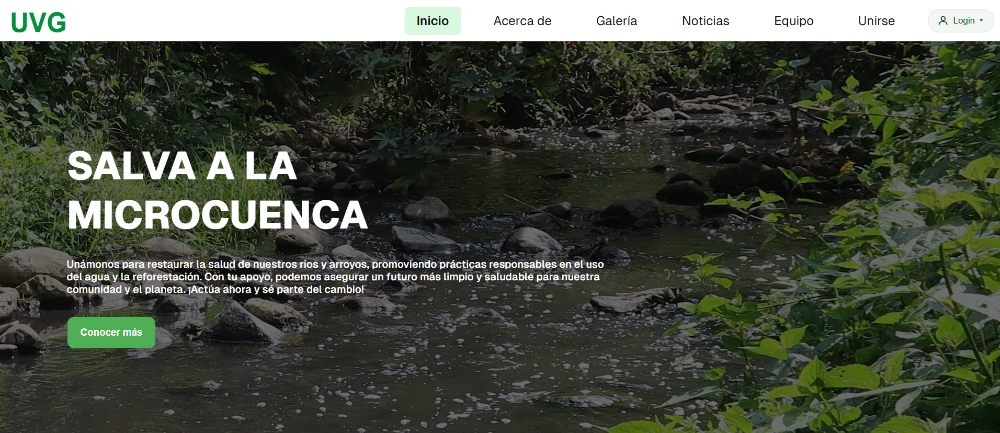
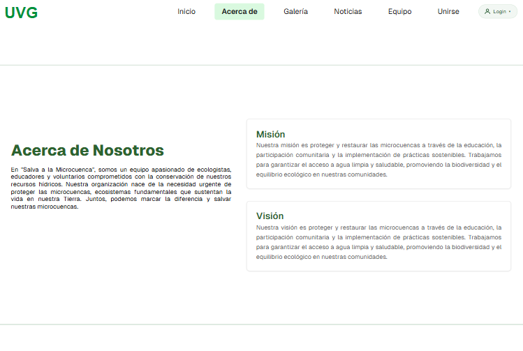
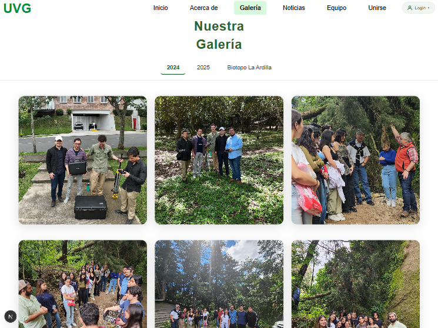
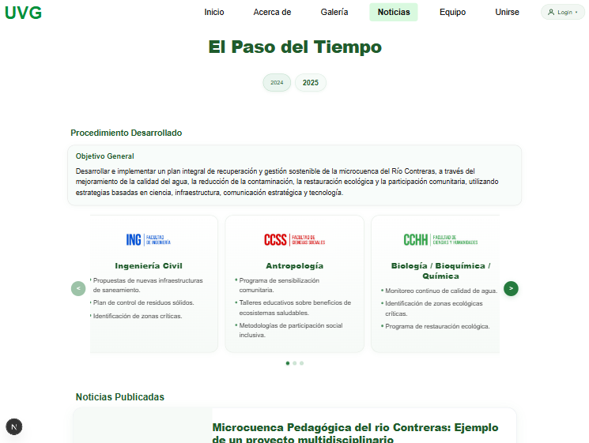
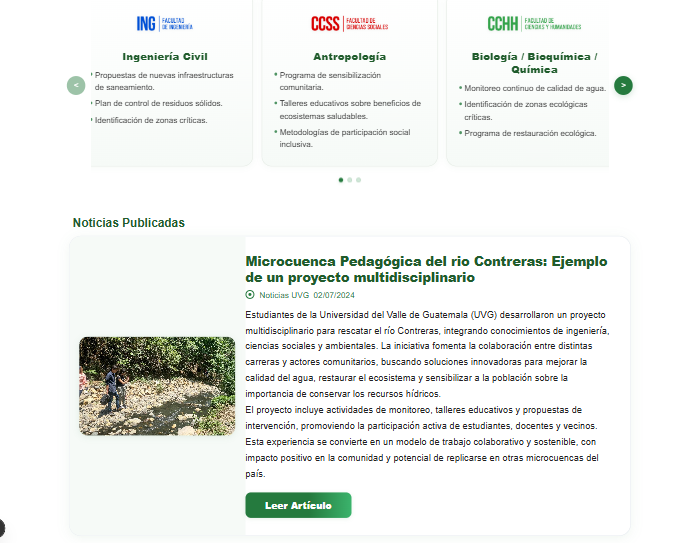
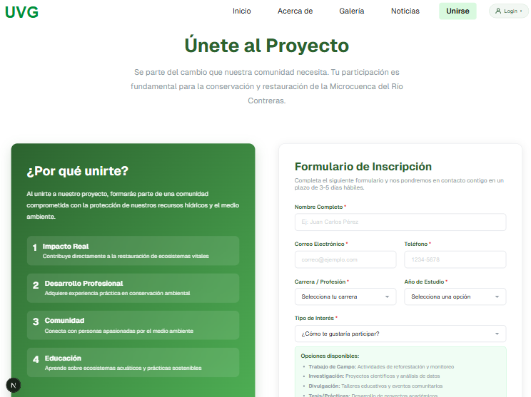
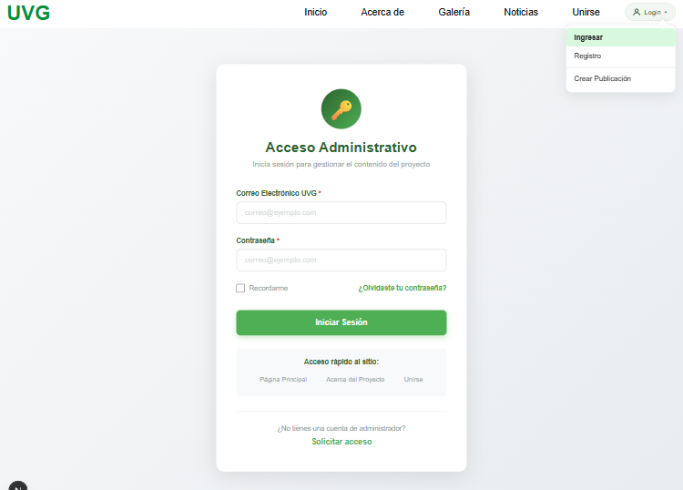
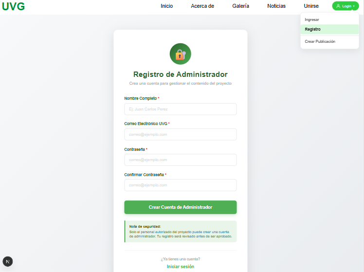
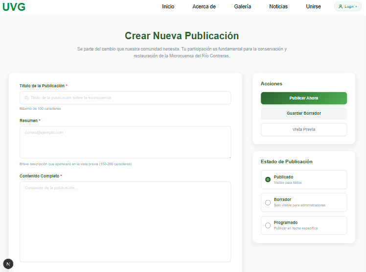

## Microcuenca – Río Motagua

Proyecto web elaborado con Next.js para documentar, comunicar y coordinar acciones relacionadas con la microcuenca pedagógica del Río Contreras y el entorno del río Motagua. Incluye secciones públicas informativas y un módulo administrativo para la publicación de noticias y contenido.

---

## Design Thinking – Fase de Empatía

### Brief del proyecto
El proyecto multidisciplinario de Microcuenca Pedagógica del Río Contreras es “una escuela de gestión social y comunitaria del agua donde se encuentran el saber de los actores principales y vecinos, con el conocimiento académico e institucional” (Funcagua, 2024). Busca desarrollar y fortalecer capacidades para la gestión integral del agua y recursos naturales del territorio, articulando conocimientos locales y académicos.

### Usuarios y actores
- Usuario 1: Tatiana Lopera — Docente y coordinadora del proyecto; busca que estudiantes participen y aporten.
- Usuario 2: Estudiantes UVG — Pueden involucrarse en estudios e investigaciones; realizan horas de extensión y generan impacto en seguridad hídrica.

### Preguntas de entrevista 
- Conocimiento del requisito de horas de extensión y estado actual.
- Familiaridad con microcuencas y su impacto comunitario.
- Motivación a participar si se ofrecen horas de extensión.
- Beneficios que motivan; factores que dificultan participación.
- Preferencia de canales de comunicación para oportunidades.

Prototipo (Figma):
[https://www.figma.com/design/KbSBpnCdHumwO0bqAZEBeg/Microcuencas?node-id=0-1](https://www.figma.com/design/i8OIrA5r21G5DjwhuR3lQk/MC-Final?node-id=0-1&t=QLDiOl01AH5UCAH1-1)

---

## Cómo correr el proyecto (Windows)

Requisitos:
- Node.js 18+ (recomendado LTS)
- npm (incluido con Node)

Comandos:
```powershell
# 1) Instalar dependencias
npm install

# 2) Levantar el servidor de desarrollo
npm run dev

# 3) Abrir el sitio
# http://localhost:3000
```

Build y producción:
```powershell
npm run build
npm start
# Servirá el sitio en producción (por defecto en http://localhost:3000)
```

Estructura de recursos:
- Las imágenes se guardan en `public/` y se referencian por ruta absoluta, por ejemplo: `/img/landing/portada.jpg`.

## Mapa de páginas y contenido

### Inicio (`/`)
- Presentación general del proyecto y objetivos.
- Acceso rápido a secciones principales: Acerca de, Galería, Noticias, Equipo, Unirse.
- Captura actual: 



### Acerca de (`/about`)
- Contexto del proyecto: marco del Río Contreras y la microcuenca pedagógica; objetivos, actores y enfoque interdisciplinario.
- Acerca de Nosotros: equipo de ecologistas, educadores y voluntarios comprometidos con la conservación de los recursos hídricos.
- Misión: proteger y restaurar microcuencas mediante educación, participación comunitaria e implementación de prácticas sostenibles para garantizar acceso a agua limpia, biodiversidad y equilibrio ecológico.
- Visión: consolidar comunidades informadas y participativas que preserven la calidad del agua y los ecosistemas, articulando ciencia, infraestructura y acción social.
- Captura actual: 



### Galería (`/galeria`)
- Galería fotográfica con navegación.
- Muestra de visitas de campo, monitoreo y actividades comunitarias.
- Rutas disponibles:
	- `/assets/img/2024/...` 
	- `/assets/img/2025/landing/landingPic.jpeg`
	- `/assets/img/vecinosBiotopoLaArdilla/...`

- Captura actual:




### Noticias / Timeline (`/timeline`)
- Sección “El Paso del Tiempo” con noticias filtradas por año.
- Procedimiento desarrollado y carrusel de facultades/programas con aportes:
	- Ingeniería Civil: saneamiento, control de residuos, identificación de zonas críticas.
	- Ciencias Sociales: sensibilización comunitaria, talleres, participación social.
	- Ciencias y Humanidades: monitoreo de calidad de agua, restauración ecológica.
- Noticias actuales (imágenes):
	- 2025: `/Rio-Contreras2025.jpg`
	- 2024: `/Microcuenca-Rio-Contreras2024.jpg`
- Elementos clave:
	- Pestañas de años, carrusel táctil con flechas y puntos.
	- Tarjetas responsivas con logos:
		- `/FacultadIngenieria.webp`
		- `/facultadCienciasSociales.webp`
		- `/facultadCienciasHumanidades.webp`

- Captura actual: 





### Unirse (`/unirse`)
- Formulario de contacto/registro de interesados.
- Información de requisitos de participación.

- Captura actual: 




## Módulo Administrador

### Login (`/admin/login`)
- Acceso de administradores al panel.
- UI: tarjeta centrada, campos de email/contraseña, “Recordarme”, enlace “¿Olvidaste tu contraseña?”.
- Estilos en `src/app/admin/admin.module.css`.

- Captura actual: 




### Registro (`/admin/register`)
- Alta de usuarios administradores.
- UI con relación al  Login; validación de campos requeridos.

- Captura actual: 




### Crear Publicación (`/admin/crear-publicacion`)
- Pantalla para crear y publicar noticias (título, resumen, imagen, enlace externo).
- Estilos en `src/app/admin/crear-publicacion/post.module.css`.
- Captura actual: 



### Header con acceso a cuenta
- En desktop: icono de usuario con texto “Login ▾” y menú desplegable (Ingresar, Registro, Crear Publicación).
- En móvil: enlaces en el menú hamburguesa.
- Archivo: `src/app/components/navbar.js` y estilos en `src/app/components/navbar.module.css`.

## Imágenes y rutas actuales

Rutas presentes en `public/` ya utilizadas por el sitio:
- Logos: `/FacultadIngenieria.webp`, `/facultadCienciasSociales.webp`, `/facultadCienciasHumanidades.webp`, `/logo-uvg.png`, `/uvg.svg`
- Noticias: `/Microcuenca-Rio-Contreras2024.jpg`, `/Rio-Contreras2025.jpg`
- Galería/landing: `/assets/img/2025/landing/landingPic.jpeg`, `/assets/img/2025/landing/2.JPG`
- Otras: `/file.svg`, `/globe.svg`, `/rio.svg`

Rutas reservadas para capturas de documentación (coloca tus PNG/JPG):
- `/img/landing/timeline_desktop.png`
- `/img/landing/timeline_mobile.png`
- `/img/landing/admin_login.png`
- `/img/landing/admin_register.png`
- `/img/landing/admin_crear_publicacion.png`
- `/img/landing/equipo.jpg`
- `/img/landing/unirse.jpg`

Ejemplo de referencia en código HTML/JSX:
```jsx


```

## Navegación rápida

- `/` Inicio
- `/about` Acerca de
- `/galeria` Galería
- `/timeline` Noticias / Timeline
- `/unirse` Unirse
- `/admin/login` Login Admin
- `/admin/register` Registro Admin
- `/admin/crear-publicacion` Crear Publicación

---

## Problema y Contexto

- Estado ambiental: presiones por residuos sólidos, aguas residuales y pérdida de cobertura vegetal, afectando calidad del agua y biodiversidad.
- Impactos: salud pública, servicios ecosistémicos, percepción comunitaria y costos de gestión municipal.
- Actores: vecinos, municipalidad de Guatemala, Empagua, Funcagua, UVG (facultades y estudiantes), organizaciones locales.
- Metas:
	- Corto plazo: sensibilización, caracterización básica del agua, mapeo de puntos críticos, participación estudiantil (horas de extensión).
	- Mediano plazo: propuestas de saneamiento, control de residuos, restauración ecológica, gobernanza comunitaria y documentación pública de avances.

---

## Arquitectura del Sitio

- `src/app/`: App Router de Next.js. Cada subcarpeta con `page.js` es una ruta.
	- `src/app/about/page.js` → `/about`
	- `src/app/galeria/page.js` → `/galeria` (si existe)
	- `src/app/timeline/page.js` → `/timeline`
	- `src/app/admin/login/page.js` → `/admin/login`
	- `src/app/admin/register/page.js` → `/admin/register`
	- `src/app/admin/crear-publicacion/page.js` → `/admin/crear-publicacion`
- `public/`: archivos estáticos (imágenes, íconos, docs). Se referencian como `/ruta-en-public`.
- `src/app/components/`: componentes compartidos (ej. `navbar.js`).
- `backend/`: servicios y pruebas del servidor Express (si se usa para correo o APIs).

---

## Flujo de Usuario

- Visitante: Inicio → Acerca de → Galería → Timeline (noticias) → Unirse.
- Administrador: Login → Crear Publicación → revisar en Timeline.

---

## Lineamientos de Contenido

- Noticia:
	- Título (claro y conciso)
	- Autor (opcional)
	- Fecha (formato `DD/MM/AAAA`)
	- Resumen (breve, 1–2 párrafos)
	- Imagen (archivo en `public/`)
	- Link (URL externa oficial)
- Nombres de archivo: usar guiones y año, p. ej. `Microcuenca-Rio-Contreras2024.jpg`.
- Ubicación de imágenes: `public/` o subcarpetas bajo `public/assets/img/<año>/...`.

---

## Guía de Contribución

### Agregar una noticia
1. Coloca la imagen en `public/` (p. ej. `/Rio-Contreras2025.jpg`).
2. Edita `src/app/timeline/page.js` y agrega un objeto en el array `noticias` con `year`, `titulo`, `autor`, `fecha`, `resumen`, `imagenes`, `link`.
3. Guarda y corre `npm run dev`; valida en `/timeline`.

### Agregar una imagen a Galería
1. Guarda la imagen bajo `public/assets/img/<año>/...`.
2. Referénciala en el componente correspondiente.
3. Verifica en `/galeria`.

---

## Accesibilidad y Responsive

- Carrusel con `scroll-snap` y soporte táctil.
- Tarjetas con `clamp(...)` para adaptarse a móviles pequeños.
- Flechas deshabilitadas en extremos y sin solapar tarjetas.
- Imágenes de noticias con `width: 100%` en móvil para evitar desbordes.
- Botones y enlaces con etiquetas y roles apropiados.

---

## Roadmap

- Protección de rutas admin (middleware y verificación de sesión).
- Cierre del dropdown al clic fuera o tecla Escape.
- Más años y categorías en el Timeline.
- Métricas básicas de visitas y participación.
- Mejoras en Galería (filtros por año/tema).

---

